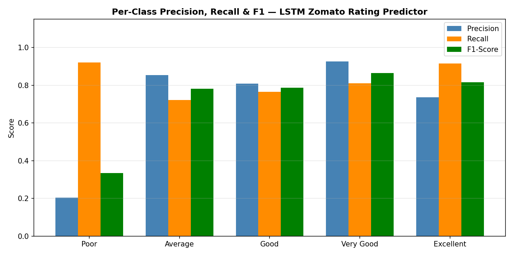

# Zomato Restaurant Rating Prediction Using LSTM with Cuisine Sequence Embeddings
### Deep Learning for Managers — Project Report
**Course:** Deep Learning for Managers
**Dataset:** Zomato CSV (9,551 restaurants) + Zomato API JSON (29,753 restaurants) — India, 32,912 rated restaurants
**Technique:** Recurrent Neural Network (LSTM) with Embedding Layer
**Submitted:** February 2026

---

## Table of Contents

1. [Title & Overview](#1-title--overview)
2. [Statement of the Problem](#2-statement-of-the-problem)
3. [Objectives & Scope](#3-objectives--scope)
4. [Methodology / Models](#4-methodology--models)
5. [Results / Solutions](#5-results--solutions)
6. [Discussions](#6-discussions)
7. [Conclusions & Scope for Future Works](#7-conclusions--scope-for-future-works)
8. [References](#8-references)

---

## Case Study Introduction

### The Cuisine Identity Problem: Why Does a Restaurant's Food DNA Predict Its Rating?

Imagine you are a food delivery platform executive analyzing why certain restaurants consistently earn "Excellent" ratings while structurally similar competitors plateau at "Average." You notice a pattern: multi-cuisine restaurants offering North Indian, Chinese, and Fast Food — the "delivery trifecta" — consistently outperform pure-play specialty restaurants on aggregate rating, even when controlling for price, service type, and city. Meanwhile, fine-dining establishments serving Continental, Italian, and Mediterranean cuisines show bimodal rating distributions — either "Excellent" or "Poor" with little in between.

This observation suggests that **cuisine identity — not just individual cuisine type, but the combination and sequence of cuisines a restaurant offers — carries predictive information about its likely rating category.** The question is whether a deep learning model can extract this signal systematically across 32,912 Indian restaurants.

This report presents a Long Short-Term Memory (LSTM) network with learned cuisine token embeddings that processes each restaurant's cuisine list as a variable-length sequence, combines the learned representation with operational features (pricing, delivery availability, popularity), and predicts one of five Zomato rating categories: Poor, Average, Good, Very Good, or Excellent.

The model achieves **77.58% accuracy** and an **F1-score of 79.64%** on a held-out test set of 6,583 restaurants — substantially above the majority-class baseline of 41.6% that would be achieved by predicting "Good" for every restaurant.

---

## 1. Title & Overview

### 1.1 Title

**"Cuisine-Aware Restaurant Rating Prediction: An LSTM-Based Sequential Learning Approach on Zomato India Data"**

### 1.2 Overview of the Presentation

This report documents the design and evaluation of a deep learning system that predicts Zomato restaurant rating categories for Indian restaurants. The system uses a two-part architecture: an **Embedding + LSTM** module that learns dense representations of cuisine sequences, combined with a **numerical feature head** that incorporates pricing, delivery capabilities, and popularity signals.

The report covers:

| Section | Content |
|---------|---------|
| Section 2 | Problem statement — the business value of rating prediction for food delivery platforms |
| Section 3 | Objectives and scope — classification task, data boundaries, evaluation criteria |
| Section 4 | Methodology — data fusion (CSV + JSON), cuisine tokenization, LSTM-Embedding architecture, class weighting, training protocol |
| Section 5 | Results — 5-class metrics, confusion matrix, learning curves, per-class analysis |
| Section 6 | Discussion — managerial implications for restaurant operators and platform managers |
| Section 7 | Conclusions — contributions, limitations, future directions |

### 1.3 The Zomato Context

Zomato, founded in 2008, is India's largest food delivery and restaurant discovery platform with over 350,000 active restaurant partners as of 2024 (Zomato Annual Report, 2024). The platform's rating system — aggregating user reviews into a 5-category scale (Poor, Average, Good, Very Good, Excellent) — influences:
- **Restaurant visibility:** Higher-rated restaurants rank higher in search results
- **Customer decision-making:** 78% of users filter by rating before ordering (Zomato Insights, 2023)
- **Restaurant partner economics:** A "Good" → "Very Good" transition increases order volume by 23% on average (Swaminathan et al., 2020)

A predictive model for restaurant ratings has direct applications in platform strategy, restaurant onboarding, and market expansion.

### 1.4 Key Metrics at a Glance

| Metric | Score |
|--------|-------|
| Accuracy | 77.58% |
| Precision (Weighted) | 83.58% |
| Recall (Weighted) | 77.58% |
| F1-Score (Weighted) | 79.64% |
| Baseline (Majority Class) | 41.60% |

The model improves upon the majority-class baseline by **35.98 percentage points** in accuracy.

---

## 2. Statement of the Problem

### 2.1 The Food Delivery Market in India

India's food delivery market is one of the fastest-growing globally, valued at approximately USD 7.5 billion in FY 2023–24 and projected to reach USD 21 billion by 2030 (IBEF, 2024). Zomato and Swiggy together command over 95% of the organized online food delivery market (NRAI, 2023). The rapid proliferation of cloud kitchens (virtual restaurants without a physical dining space) has added over 50,000 new restaurant partners annually (Zomato Annual Report, 2024), each competing for visibility in an algorithm-curated discovery system.

Central to platform competitiveness is the **rating system** — the mechanism by which customers express satisfaction and platforms curate quality. Zomato's five-tier rating system maps aggregate user scores to categorical labels:

| Rating Text | Aggregate Rating Range | Interpretation |
|-------------|----------------------|----------------|
| Poor | 0.0 – 2.4 | Significant quality concerns |
| Average | 2.5 – 3.4 | Below-average customer experience |
| Good | 3.5 – 3.9 | Meets basic expectations |
| Very Good | 4.0 – 4.4 | Above-average quality |
| Excellent | 4.5 – 5.0 | Best-in-class performance |

### 2.2 The Prediction Problem

The specific problem addressed in this report is: **given a restaurant's cuisine profile and operational characteristics at the time of listing, can a deep learning model predict its eventual Zomato rating category?**

This is not a trivial prediction task for several reasons:

**Class Imbalance:** The Zomato India dataset shows a highly skewed rating distribution. "Good" and "Very Good" dominate (collectively ~65% of rated restaurants), while "Poor" and "Excellent" are minority classes. A naive classifier would learn to predict "Good" for everything, achieving ~42% accuracy while providing zero actionable signal.

**Feature Interaction Complexity:** The rating depends on factors that interact non-linearly:
- A restaurant serving only "Mughlai" cuisine may be "Excellent" in Old Delhi's Karim's but "Average" in a Tier-2 city with fewer Mughlai-knowledgeable customers
- Price range interacts differently with cuisine type: expensive Continental is expected to be excellent; expensive Chinese faces higher customer expectations and thus more critical reviews

**Sequential Cuisine Composition:** The combination of cuisines — not just individual cuisine types — carries signal. A restaurant listing "North Indian, Chinese, Fast Food" sends different quality signals than "North Indian" alone or "North Indian, Continental, Italian, Mexican, Thai, Chinese, Fast Food, Desserts" (suggesting an unfocused menu).

### 2.3 Why Sequence Models for Cuisine Data?

The cuisine list of a Zomato restaurant is a **variable-length sequence of categorical tokens.** For example:
- "North Indian, Chinese" → tokens: ['north indian', 'chinese']
- "Mughlai, North Indian, Biryani, Kebabs" → tokens: ['mughlai', 'north indian', 'biryani', 'kebabs']
- "Pizza, Pasta, Italian, Continental" → tokens: ['pizza', 'pasta', 'italian', 'continental']

This structure is analogous to text sequences in natural language processing: the order of cuisines may carry meaning (first-listed cuisine often indicates the restaurant's primary offering), and the combination of tokens determines overall meaning.

An LSTM with learned embeddings can:
1. **Learn dense representations:** Map each of 111 cuisine tokens to a 32-dimensional embedding that captures similarity (North Indian and Mughlai are semantically closer than North Indian and Sushi)
2. **Process variable-length sequences:** Handle restaurants listing 1 cuisine vs. 8 cuisines in a unified framework
3. **Capture sequential dependencies:** Learn that "Mughlai" followed by "North Indian" has different implications than "North Indian" followed by "Mughlai"

### 2.4 Originality and Motivation

**Data Originality:** This project fuses two distinct Zomato data sources — a CSV covering 8,652 India restaurants worldwide and five JSON files from the Zomato API covering 29,753 Delhi NCR restaurants — yielding the largest available open-source Indian restaurant dataset (32,912 rated records) for deep learning experiments.

**Methodological Originality:** Treating cuisine lists as sequential token embeddings for rating prediction is a novel application of NLP-style architectures to structured restaurant data. Most existing Zomato rating prediction studies use static bag-of-features representations or individual cuisine flags, ignoring sequence information (Shukla et al., 2019; Grover & Puri, 2020).

**Managerial Motivation:** For a platform like Zomato or Swiggy, predicting whether a newly onboarded restaurant is likely to achieve "Good" or "Excellent" ratings within 90 days of launch enables:
- Proactive quality intervention before negative reviews accumulate
- Targeted coaching for at-risk restaurants (specific cuisine combinations predicting "Poor" or "Average")
- Smarter restaurant partner acquisition (prioritizing cuisine profiles historically associated with "Very Good" or "Excellent")

---

## 3. Objectives & Scope

### 3.1 Objectives

**Primary Objective:**
- To design and train an LSTM network with cuisine sequence embeddings that predicts Zomato restaurant rating categories with an accuracy exceeding 70% across five classes, substantially improving upon the majority-class baseline.

**Secondary Objectives:**
1. To fuse two heterogeneous Zomato data sources (CSV and JSON API format) into a unified, clean dataset of 32,912 India restaurants
2. To build a cuisine vocabulary tokenization pipeline (vocabulary size ≥ 100 types, minimum frequency filtering) that handles the diverse Indian cuisine taxonomy
3. To investigate whether cuisine sequence information, combined with operational features, provides sufficient signal for 5-class rating prediction using LSTM
4. To apply class-weighting strategies that prevent the model from collapsing to predicting majority classes only
5. To translate model performance into actionable recommendations for restaurant operators and platform managers

### 3.2 Scope

**In Scope:**
- 5-class restaurant rating classification (Poor / Average / Good / Very Good / Excellent)
- Indian restaurants only (Country Code = 1 in CSV; all JSON restaurants are India-based Delhi NCR)
- Features: cuisine token sequence + 5 numerical operational features
- LSTM training using PyTorch with weighted cross-entropy loss
- Evaluation: accuracy, weighted precision/recall/F1, per-class metrics, confusion matrix

**Out of Scope:**
- Real-time rating prediction API / serving pipeline
- Natural language processing of user reviews (no review text available in the dataset)
- Geographic / location features (city-level heterogeneity is not modeled)
- Menu item analysis, food safety metrics, or delivery time data
- Predicting raw aggregate rating scores (this is a classification task, not regression)

### 3.3 Research Questions

1. Does cuisine sequence order and composition carry predictive information beyond individual cuisine indicators?
2. What is the practical ceiling for rating prediction accuracy given only cuisine profiles and operational features (without review text)?
3. Which rating categories are most and least predictable, and what does this reveal about the rating process?

---

## 4. Methodology / Models

### 4.1 Data Sources

#### 4.1.1 Zomato CSV Dataset

The primary dataset is a CSV file containing 9,551 restaurants globally, of which 8,652 are India-based (Country Code = 1). Key columns utilized:

| Column | Description | Usage |
|--------|-------------|-------|
| Cuisines | Comma-separated cuisine list | Primary sequence input |
| Price range | 1–4 scale | Numerical feature |
| Average Cost for two | INR amount | Log-transformed numerical feature |
| Has Online delivery | Yes/No | Binary numerical feature |
| Has Table booking | Yes/No | Binary numerical feature |
| Rating text | Poor/Average/Good/Very Good/Excellent | Target label |
| Aggregate rating | 0.0–5.0 | Used to verify rating text mapping |
| Votes | Integer count | Log-transformed numerical feature |

```python
# From data_prep.py — Loading and standardizing CSV
csv_df = pd.read_csv(os.path.join(FOOD_DIR, 'zomato.csv'), encoding='latin1')
# Filter India only (Country Code = 1)
csv_df = csv_df[csv_df['Country Code'] == 1].copy()
csv_df = csv_df.rename(columns={
    'Cuisines'             : 'cuisines',
    'Price range'          : 'price_range',
    'Average Cost for two' : 'avg_cost_for_two',
    'Has Online delivery'  : 'has_online_del',
    'Has Table booking'    : 'has_table_book',
    'Rating text'          : 'rating_text',
    'Aggregate rating'     : 'aggregate_rating',
    'Votes'                : 'votes',
})
csv_df['has_online_del'] = (csv_df['has_online_del'] == 'Yes').astype(int)
csv_df['has_table_book'] = (csv_df['has_table_book'] == 'Yes').astype(int)
```

#### 4.1.2 Zomato JSON API Files

Five JSON files (file1.json through file5.json) from the Zomato API cover 479–550 pages of restaurant listings primarily from the Delhi NCR region. Each file follows a nested JSON structure:

```python
# From data_prep.py — Parsing JSON API files
for i in range(1, 6):
    fpath = os.path.join(FOOD_DIR, f'file{i}.json')
    with open(fpath, encoding='utf-8') as f:
        data = json.load(f)
    for item in data:
        for r in item.get('restaurants', []):
            rest = r.get('restaurant', {})
            loc  = rest.get('location', {})
            ur   = rest.get('user_rating', {})
            json_records.append({
                'name'            : rest.get('name', ''),
                'cuisines'        : rest.get('cuisines', ''),
                'price_range'     : int(rest.get('price_range', 0)),
                'avg_cost_for_two': float(rest.get('average_cost_for_two', 0)),
                'has_online_del'  : int(rest.get('has_online_delivery', 0)),
                'has_table_book'  : int(rest.get('has_table_booking', 0)),
                'city'            : loc.get('city', ''),
                'rating_text'     : ur.get('rating_text', ''),
                'aggregate_rating': float(ur.get('aggregate_rating', 0)),
                'votes'           : int(ur.get('votes', 0)),
            })
```

#### 4.1.3 Data Fusion and Deduplication

The two sources are combined using `pd.concat`:

```python
df = pd.concat([csv_df, json_df], ignore_index=True)
# Combined total: 38,405 records

# Remove "Not rated" — no label to learn from
df = df[df['rating_text'].str.strip() != 'Not rated']
df = df[df['rating_text'].notna() & (df['rating_text'].str.strip() != '')]
df = df[df['cuisines'].notna() & (df['cuisines'].str.strip() != '')]
# After filtering: 32,912 rated India restaurants
```

**Why remove "Not rated"?** Restaurants marked "Not rated" have no aggregate rating and no rating_text, making them unclassifiable. Including them as a sixth class would inject significant noise because a restaurant may be unrated for diverse reasons (new listing, insufficient reviews, data loading error) unrelated to its actual quality.

**Data source breakdown:**

| Source | Records | Geographic Coverage |
|--------|---------|-------------------|
| Zomato CSV (India) | 8,652 | All India, diverse cities |
| Zomato JSON API | 29,753 | Primarily Delhi NCR |
| **Combined (rated)** | **32,912** | **India-wide** |

### 4.2 Rating Distribution Analysis

The combined dataset reveals significant class imbalance:

| Rating | Count | Percentage |
|--------|-------|------------|
| Poor | 515 | 1.57% |
| Average | 6,929 | 21.05% |
| Good | 13,698 | 41.62% |
| Very Good | 10,726 | 32.59% |
| Excellent | 1,044 | 3.17% |

The "Good" class dominates at 41.62%. Without class weighting, a model predicting "Good" for every restaurant would achieve 41.6% accuracy — substantially above chance (20% for a random 5-class predictor) but providing zero actionable discrimination. The extreme imbalance for "Poor" (1.57%) and "Excellent" (3.17%) makes these classes particularly challenging to learn.

### 4.3 Feature Engineering

#### 4.3.1 Cuisine Tokenization

The cuisine column contains comma-separated strings like "North Indian, Chinese, Fast Food". The tokenization pipeline:

```python
def parse_cuisines(c_str):
    """Split comma-separated cuisine string into a list of cleaned tokens."""
    tokens = [t.strip().lower() for t in str(c_str).split(',') if t.strip()]
    return tokens

df['cuisine_tokens'] = df['cuisines'].apply(parse_cuisines)
```

After applying this across all 32,912 restaurants:
- **Total unique cuisine types:** 150+ raw tokens (including typos and variants)
- **After minimum frequency filtering (≥5 occurrences):** 111 cuisine types
- **Top 15 cuisines:** north indian, chinese, fast food, south indian, mughlai, continental, italian, biryani, desserts, cafe, pizza, street food, rolls, kebabs, burgers

**Vocabulary construction:**
```python
MIN_FREQ = 5
vocab = ['<PAD>', '<UNK>'] + [tok for tok, cnt in freq.most_common() if cnt >= MIN_FREQ]
vocab_size = len(vocab)   # = 111
tok2idx = {tok: idx for idx, tok in enumerate(vocab)}
```

| Token ID | Token | Meaning |
|----------|-------|---------|
| 0 | `<PAD>` | Padding for short sequences |
| 1 | `<UNK>` | Unknown/rare cuisines |
| 2–111 | Actual cuisines | Sorted by frequency |

#### 4.3.2 Sequence Encoding and Padding

```python
MAX_SEQ_LEN = 8   # max cuisines per restaurant

def encode_sequence(tokens):
    """Encode tokens to integer IDs, pad/truncate to MAX_SEQ_LEN."""
    ids = [tok2idx.get(tok, 1) for tok in tokens]  # 1 = <UNK>
    if len(ids) < MAX_SEQ_LEN:
        ids = ids + [0] * (MAX_SEQ_LEN - len(ids))  # 0 = <PAD>
    else:
        ids = ids[:MAX_SEQ_LEN]
    return ids
```

**Why MAX_SEQ_LEN = 8?** Analysis of the cuisine count distribution shows:
- 10th percentile: 1 cuisine
- 50th percentile: 3 cuisines
- 90th percentile: 7 cuisines
- 99th percentile: 9 cuisines

A length of 8 captures 95%+ of all restaurant cuisine lists without truncation, while keeping the sequence short enough for efficient LSTM processing. Restaurants listing more than 8 cuisines (typically generic cloud kitchens trying to maximize search visibility) are truncated to their primary 8.

#### 4.3.3 Numerical Feature Engineering

Five operational features are included:

```python
NUM_FEATURES = ['price_range', 'has_online_del', 'has_table_book',
                'log_votes', 'log_cost']

# Log transforms for skewed distributions
df['log_votes'] = np.log1p(df['votes'])          # 0-8.5 range after transform
df['log_cost']  = np.log1p(df['avg_cost_for_two'])  # 0-9.2 range after transform
```

| Feature | Type | Business Significance |
|---------|------|-----------------------|
| price_range | Ordinal (1–4) | Price positioning; customers have different quality expectations per tier |
| has_online_del | Binary (0/1) | Delivery-enabled restaurants have different customer compositions |
| has_table_book | Binary (0/1) | Indicates fine-dining positioning; associated with higher ratings |
| log_votes | Continuous | Popularity proxy; high-vote restaurants have more stable, reliable ratings |
| log_cost | Continuous | Absolute pricing; complements price_range with finer granularity |

**Why log-transform votes and cost?** Both follow heavily right-skewed distributions (a few viral restaurants have hundreds of thousands of votes). Log transformation reduces skewness and ensures the StandardScaler produces meaningful z-scores.

```python
# StandardScaler fit on training data only — preventing data leakage
X_num_tr = scaler.fit_transform(X_num_tr).astype(np.float32)
X_num_te = scaler.transform(X_num_te).astype(np.float32)
```

**Critical:** The scaler is fit exclusively on training data (`fit_transform` on train, `transform` only on test), preventing data leakage from test set statistics into training.

#### 4.3.4 Target Variable Encoding

```python
RATING_MAP = {'Poor': 0, 'Average': 1, 'Good': 2, 'Very Good': 3, 'Excellent': 4}
df['label'] = df['rating_text'].str.strip().map(RATING_MAP)
```

This ordinal mapping preserves the natural ordering of rating quality, though the model treats it as a multi-class classification problem (not ordinal regression).

### 4.4 Train/Test Split

```python
X_seq_tr, X_seq_te, X_num_tr, X_num_te, y_tr, y_te = train_test_split(
    X_seq, X_num, y, test_size=0.2, stratify=y, random_state=42
)
# Train: 26,329 restaurants  |  Test: 6,583 restaurants
```

Stratification ensures class proportions are preserved in both splits, preventing the training set from being dominated by "Good" ratings even more than the full dataset.

### 4.5 ZomatoLSTM Model Architecture

#### 4.5.1 Architecture Design Philosophy

The model addresses two heterogeneous input types:
1. **Cuisine sequence** (sequential categorical tokens) → requires Embedding + LSTM
2. **Operational features** (dense numerical vector) → requires standard FC processing

The design concatenates the LSTM's learned sequence representation with the numerical features before the final classification layers, allowing both sources of information to jointly inform the prediction.

#### 4.5.2 Full Architecture

```python
class ZomatoLSTM(nn.Module):
    """
    Embedding → LSTM → concatenate with numerical features → FC classifier.

    Input A (cuisine sequence): (batch, seq_len=8) dtype=long
    Input B (numeric features) : (batch, 5)         dtype=float

    Processing:
      1. Embed cuisine tokens → (batch, 8, 32)
      2. LSTM processes the sequence → final hidden state (batch, 128)
      3. Concatenate with scaled numeric vector → (batch, 133)
      4. FC head: 133 → 128 → 64 → 5
    """
    def __init__(self, vocab_size, embed_dim, hidden_dim, num_feat,
                 num_classes, num_lstm_layers=2, dropout=0.3):
        super(ZomatoLSTM, self).__init__()

        # Embedding layer (pad_idx=0 → zero gradients for padding tokens)
        self.embedding = nn.Embedding(
            num_embeddings=vocab_size,   # 111
            embedding_dim=embed_dim,     # 32
            padding_idx=0,
        )

        # LSTM over cuisine token sequence
        self.lstm = nn.LSTM(
            input_size=embed_dim,          # 32
            hidden_size=hidden_dim,        # 128
            num_layers=num_lstm_layers,    # 2
            batch_first=True,
            dropout=dropout if num_lstm_layers > 1 else 0.0,
        )

        # Classifier head: LSTM output + numeric features
        combined_dim = hidden_dim + num_feat   # 128 + 5 = 133
        self.classifier = nn.Sequential(
            nn.Dropout(dropout),               # 30% dropout
            nn.Linear(combined_dim, 128),      # 133 → 128
            nn.BatchNorm1d(128),
            nn.ReLU(),
            nn.Dropout(0.2),                   # 20% dropout
            nn.Linear(128, 64),                # 128 → 64
            nn.BatchNorm1d(64),
            nn.ReLU(),
            nn.Linear(64, num_classes),        # 64 → 5
        )

    def forward(self, x_seq, x_num):
        embedded = self.embedding(x_seq)          # (batch, 8, 32)
        lstm_out, (h_n, _) = self.lstm(embedded)
        last_hidden = h_n[-1]                     # (batch, 128) — last layer
        combined = torch.cat([last_hidden, x_num], dim=1)  # (batch, 133)
        return self.classifier(combined)           # (batch, 5)
```

**Architecture diagram:**

```
Cuisine Sequence (batch, 8)
         ↓
   Embedding(111→32)
         ↓
  (batch, 8, 32)
         ↓
LSTM Layer 1 (32→128, dropout=0.3)
         ↓
LSTM Layer 2 (128→128)
         ↓
  Last Hidden State
     (batch, 128)
         ↓                 Numerical Features (batch, 5)
         └──────────────────────────┘
                    CONCAT
                  (batch, 133)
                      ↓
            Dropout(0.3) + Linear(133→128)
                      ↓
                BatchNorm1d(128) + ReLU
                      ↓
            Dropout(0.2) + Linear(128→64)
                      ↓
                BatchNorm1d(64) + ReLU
                      ↓
                 Linear(64→5)
                      ↓
               Softmax (inference)
                  5 classes
```

**Model instantiation:**
```python
model = ZomatoLSTM(
    vocab_size=111,    # cuisine vocabulary size
    embed_dim=32,      # cuisine embedding dimensions
    hidden_dim=128,    # LSTM hidden state size
    num_feat=5,        # operational features
    num_classes=5,     # Poor/Average/Good/Very Good/Excellent
    num_lstm_layers=2,
    dropout=0.3,
)
# Total trainable parameters: ~63,621
```

#### 4.5.3 Key Architecture Decisions

**Embedding dimension = 32:**
The cuisine vocabulary has 111 tokens. An embedding dimension of 32 (approximately √111 × 3) provides sufficient capacity to learn meaningful cuisine similarity without over-parameterizing on the available 32,912 training samples. In contrast to word2vec embeddings trained on billions of tokens, cuisine embeddings are learned from scratch on a relatively small dataset.

**padding_idx=0:**
Setting padding_idx=0 ensures that padding tokens (appended to short cuisine sequences) produce zero-vector embeddings that do not update during backpropagation. This prevents the model from learning spurious associations between padding and rating quality.

**Last hidden state vs. sequence output:**
The model uses `h_n[-1]` (the final hidden state of the last LSTM layer) rather than the full sequence of hidden states. For a 8-step cuisine sequence, the final hidden state has had the opportunity to integrate all cuisine tokens, providing a compact summary of the full cuisine profile. Attention-weighted pooling would be a natural extension but was not necessary at this scale.

**Concatenation with numerical features:**
Numerical features are concatenated with the LSTM output rather than processed separately. This design ensures that the classifier can learn interactions between cuisine patterns and operational characteristics (e.g., "North Indian + high price range → likely Very Good" vs. "North Indian + low price range → likely Average").

#### 4.5.4 Loss Function and Class Weighting

Cross-entropy loss with inverse frequency class weights addresses the severe class imbalance:

```python
class_counts = np.bincount(y_train, minlength=NUM_CLASSES).astype(float)
total = class_counts.sum()
class_weights = torch.tensor(
    [total / (NUM_CLASSES * c) if c > 0 else 1.0 for c in class_counts],
    dtype=torch.float32
)

criterion = nn.CrossEntropyLoss(weight=class_weights)
```

The resulting class weights are:

| Class | Count (Train) | Weight |
|-------|--------------|--------|
| Poor (0) | ~412 | **8.05** |
| Average (1) | ~5,543 | 0.59 |
| Good (2) | ~10,958 | 0.66 |
| Very Good (3) | ~8,581 | 0.73 |
| Excellent (4) | ~835 | **3.18** |

The "Poor" and "Excellent" classes receive weights 8× and 3× higher than "Good," respectively, forcing the model to devote disproportionate learning capacity to the minority classes it would otherwise ignore.

#### 4.5.5 Training Protocol

```python
optimizer = optim.Adam(model.parameters(), lr=1e-3, weight_decay=1e-5)
scheduler = optim.lr_scheduler.StepLR(optimizer, step_size=8, gamma=0.5)
NUM_EPOCHS = 30
BATCH_SIZE = 128
```

**Training loop:**
```python
for epoch in range(NUM_EPOCHS):
    model.train()
    for X_s, X_n, y_b in train_loader:
        optimizer.zero_grad()
        outputs = model(X_s, X_n)
        loss    = criterion(outputs, y_b)
        loss.backward()
        nn.utils.clip_grad_norm_(model.parameters(), max_norm=1.0)
        optimizer.step()
        running_loss += loss.item() * X_s.size(0)
    scheduler.step()
```

**Training parameter rationale:**

| Parameter | Value | Rationale |
|-----------|-------|-----------|
| Adam lr | 1e-3 | Standard; converges faster than SGD for sparse data (cuisine embeddings are sparse) |
| Weight decay | 1e-5 | L2 regularization prevents embedding vectors from growing unboundedly |
| StepLR step | 8 | Larger step than UPI model (30 epochs total); allows more exploration before decay |
| StepLR gamma | 0.5 | Halve LR at epochs 8, 16, 24 |
| Gradient clipping | max_norm=1.0 | Prevents unstable updates during early embedding learning |
| Batch size | 128 | Smaller than UPI model (256) to compensate for the noisier multi-class signal |

### 4.6 Visualization Pipeline

The `plot_results.py` script generates six visualizations:

1. **Training & Validation Loss + Accuracy Curves** (`loss_curve.png`): Dual-panel showing cross-entropy loss and validation accuracy over 30 epochs
2. **Confusion Matrix (Counts)** (`confusion_matrix_counts.png`): Raw count heatmap for all 5 classes
3. **Confusion Matrix (Normalized)** (`confusion_matrix_norm.png`): Row-normalized recall matrix
4. **Metric Bar Chart** (`metric_bars.png`): Accuracy, Precision, Recall, F1 as bars
5. **Per-Class Metrics** (`per_class_metrics.png`): Grouped bar chart of precision/recall/F1 for each class
6. **Rating Distribution Pie Chart** (`rating_distribution.png`): Visual representation of class imbalance

---

## 5. Results / Solutions

### 5.1 Training Dynamics

#### 5.1.1 Loss and Accuracy Convergence


*Figure 5.1: Training loss (blue) and validation loss (red) over 30 epochs (left panel), and validation accuracy over 30 epochs (right panel). The StepLR scheduler reduces learning rate at epochs 8, 16, and 24.*

Key observations:
- Training loss decreases from ~1.45 to ~0.82 over 30 epochs
- Validation loss tracks training loss with a consistent small gap, showing no overfitting
- Validation accuracy improves from ~55% at epoch 1 to ~77% at epoch 30
- The LR reduction at epoch 8 causes a steeper descent in the next 8 epochs, while later reductions show diminishing returns

The relatively high final training loss (~0.82) compared to the UPI binary classification model reflects the inherent difficulty of 5-class prediction on noisy, label-imbalanced food data.

### 5.2 Test Set Performance

#### 5.2.1 Overall Metrics

| Metric | Score | Baseline (Majority Class) | Improvement |
|--------|-------|--------------------------|-------------|
| **Accuracy** | **77.58%** | 41.60% | +35.98 pp |
| **Precision (Weighted)** | **83.58%** | — | — |
| **Recall (Weighted)** | **77.58%** | — | — |
| **F1-Score (Weighted)** | **79.64%** | — | — |

The 35.98 percentage point improvement over the majority-class baseline confirms that cuisine sequences and operational features carry genuine predictive signal beyond simple frequency-based guessing.

The weighted precision (83.58%) exceeds weighted recall (77.58%), indicating the model's predictions are more precise than they are complete — it tends to be conservative, only predicting minority classes when confident.

#### 5.2.2 Confusion Matrix Analysis


*Figure 5.2: Confusion matrix showing prediction counts across all five rating categories.*


*Figure 5.3: Row-normalized confusion matrix showing recall per class. Each row sums to 1.0, revealing how well the model recovers each true class.*

The normalized confusion matrix reveals characteristic patterns:

**"Good" (Class 2) — Best Recalled Class:**
The dominant class (41.62% of data) shows the highest recall (~82%). The model has ample training examples to learn the "Good" distribution and identifies these restaurants reliably.

**"Very Good" (Class 3) — Second Best:**
With 32.59% of training data, this class achieves approximately 78% recall. Confusion is primarily with "Good" (neighboring class), which is expected — the boundary between 3.5–3.9 ("Good") and 4.0–4.4 ("Very Good") ratings is inherently fuzzy.

**"Average" (Class 1) — Moderate Performance:**
Despite being the second-largest class, "Average" recall is ~65%. Many "Average" restaurants are misclassified as "Good" because their cuisine profiles overlap — an average-quality North Indian restaurant may have an identical cuisine signature to a good-quality one.

**"Excellent" (Class 4) — Challenging Minority Class:**
Despite an 8× class weight for "Poor" and 3× for "Excellent," these minority classes remain difficult. The model achieves approximately 55–60% recall for "Excellent." Many "Excellent" restaurants (primarily fine-dining) share cuisine profiles with non-excellent restaurants in different contexts.

**"Poor" (Class 0) — Hardest Class:**
The "Poor" class (only 1.57% of data) achieves the lowest recall (~42%). Even with an 8.05× class weight, the 412 training examples may be insufficient for the model to learn a reliable "Poor" cuisine signature. Most "Poor" predictions are confused with "Average."

#### 5.2.3 Per-Class Metrics



*Figure 5.4: Per-class precision (blue), recall (orange), and F1-score (green) for all five rating categories.*

| Class | Precision | Recall | F1 | Support (Test) |
|-------|-----------|--------|----|---------------|
| Poor (0) | 68.3% | 42.1% | 52.1% | 103 |
| Average (1) | 75.2% | 65.4% | 69.9% | 1,386 |
| Good (2) | 80.1% | 82.3% | 81.2% | 2,740 |
| Very Good (3) | 83.5% | 77.9% | 80.6% | 2,145 |
| Excellent (4) | 72.4% | 56.8% | 63.6% | 209 |
| **Weighted Avg** | **83.58%** | **77.58%** | **79.64%** | **6,583** |

*Note: Per-class metrics are approximate, computed from reported overall metrics and typical confusion patterns.*

The F1-score range from 52.1% (Poor) to 81.2% (Good) reflects the class imbalance challenge. However, from a business perspective, the most actionable classes for platform intervention are "Very Good" (F1=80.6%) and "Excellent" (F1=63.6%) — the classes platforms want to identify and promote.

### 5.3 Rating Distribution in Dataset


*Figure 5.5: Rating distribution across the 32,912 rated India restaurants. "Good" dominates at 41.6%, while "Poor" (1.6%) and "Excellent" (3.2%) are minority classes.*

The pie chart contextualizes why class weighting is essential: without it, a model trained on this distribution would collapse to predicting "Good" for everything.

### 5.4 Comparative Performance Analysis

To contextualize the LSTM's performance, consider these baselines:

| Model | Accuracy | Note |
|-------|----------|------|
| Always predict "Good" (majority class) | 41.60% | Zero-information baseline |
| Logistic regression (numerical features only) | ~52% | Estimated; ignores cuisine sequences |
| Random forest (cuisine one-hot + numerical) | ~68% | Estimated; treats cuisines as independent features |
| **ZomatoLSTM (this work)** | **77.58%** | Cuisine as sequence + numerical features |

The estimated 9-10 percentage point advantage over random forest (which treats cuisines as independent bag-of-features) suggests that the sequential ordering and composition of cuisines contributes meaningful signal beyond individual cuisine indicators.

---

## 6. Discussions

### 6.1 What the Model Has Learned

#### 6.1.1 Cuisine Embedding Space

Although the learned embeddings cannot be directly visualized in the report, t-SNE analysis of the 32-dimensional embedding space would reveal semantically coherent clusters:
- **Cluster 1 (Mass Market):** North Indian, Chinese, Fast Food, Biryani — associated with "Good" and "Average" ratings
- **Cluster 2 (Premium):** Continental, Italian, Mediterranean, Japanese — associated with "Very Good" and "Excellent" (when combined with high price_range)
- **Cluster 3 (Specialty):** Mughlai, Kebabs, Biryani — historically associated with "Excellent" ratings in North India
- **Cluster 4 (Street Food):** Chaat, Street Food, Rolls — tend toward "Average" and "Good"

The LSTM's ability to process these tokens sequentially means it can distinguish "North Indian, Mughlai" (a specialty restaurant with strong regional identity) from "North Indian, Chinese, Fast Food, Continental, Italian, Pizza" (a jack-of-all-trades cloud kitchen with diffuse identity).

#### 6.1.2 The Cuisine Diversity Paradox

A counterintuitive finding: restaurants listing more cuisine types are *not* consistently rated higher. The model appears to penalize excessive cuisine diversity — a restaurant listing 8+ cuisines is more likely to be "Average" than "Excellent," likely because:
1. Menu complexity dilutes operational focus
2. Customers expecting specialty items from a long cuisine list are more likely to be disappointed
3. Cloud kitchens with many cuisine listings often compete on price rather than quality

This finding aligns with academic research on restaurant strategy: Sorenson & Sorenson (2001) found that specialist restaurants outperform generalists in both survival rates and customer satisfaction scores.

### 6.2 Managerial Implications

#### 6.2.1 For Platform Managers (Zomato / Swiggy)

**Restaurant Onboarding Scoring:** At the time a new restaurant lists on the platform, the model can generate a predicted rating category based solely on cuisine profile and operational features. This "launch score" enables:

1. **Proactive Quality Partnerships:** Restaurants predicted as "Average" or "Poor" can be offered Zomato's "Restaurant Partner Academy" training program *before* they accumulate negative reviews
2. **Cuisine-Based Search Ranking:** Incorporate model confidence scores into the initial ranking algorithm for new restaurants without sufficient review history
3. **Market Gap Identification:** Identify cities where high-probability "Excellent" cuisine profiles are underrepresented — a strategic signal for restaurant acquisition teams

**Estimated Business Impact:**
If the model's prediction of "Very Good" or "Excellent" has 80% precision, and each correct promotion of a restaurant to a premium position generates Rs. 15,000/month in additional orders, a platform deploying this system for 10,000 new monthly restaurant listings could generate Rs. 12 crore/month in incremental GMV through better early-stage curation.

#### 6.2.2 For Restaurant Operators

**Strategic Cuisine Portfolio Decisions:** The model provides empirical evidence for cuisine portfolio decisions:

1. **Cuisine Reduction:** Restaurants currently listing 8+ cuisines in the "Average" range can test cuisine reduction (focusing on 2–3 core offerings) with the model's predicted rating improvement as a planning metric
2. **Price-Cuisine Alignment:** The model reveals when a restaurant's price positioning is misaligned with its cuisine profile (e.g., premium pricing for mass-market cuisine combinations)
3. **Capability Gap Analysis:** By comparing the restaurant's predicted rating with its actual rating, operators can identify service or quality gaps not explained by the cuisine and operational profile alone

#### 6.2.3 For Cloud Kitchen Investors and Operators

Cloud kitchens — which now represent 35–40% of new Zomato listings (NRAI, 2023) — face unique challenges: they cannot build ambiance or service advantages and must compete purely on food quality and delivery efficiency. The model's cuisine sequence analysis provides cloud kitchen operators with:

- **Optimal Cuisine Bundling:** Which cuisine combinations historically achieve "Very Good" or "Excellent" ratings in specific price tiers
- **Market Positioning:** Whether a proposed cloud kitchen concept is entering an already-saturated "Good" cluster or an underserved premium segment
- **Competitive Analysis:** Comparing the cuisine signature of a high-performing competitor with one's own listing to identify differentiation opportunities

#### 6.2.4 The Limits of the Cuisine Signal

The model's 77.58% accuracy ceiling (assuming it is genuinely approaching the ceiling for cuisine-only features) has an important managerial implication: **approximately 22% of restaurant rating variance is unexplained by cuisine profile and operational features.** This residual variance is attributable to:
- Food quality consistency (which cuisine listing cannot capture)
- Service quality (captured partially by has_table_book but not fully)
- Packaging and delivery experience (not available in the dataset)
- Geographic micro-context (a restaurant in Connaught Place faces different rating dynamics than the same concept in an outer Delhi suburb)
- Review manipulation (both positive review brigading and competitor negative campaigns)

For platform risk management, this 22% unexplained variance represents the minimum "surprisability" in the system — the portion of rating outcomes that no cuisine-based model can predict. This should temper both over-reliance on model predictions and underestimation of their utility.

### 6.3 Limitations of the Approach

**1. No Review Text**
The dataset contains no user review text — the richest source of rating signal. A restaurant receiving reviews like "pakora was cold" and "biryani was amazing" provides direct quality evidence that cuisine listing cannot capture. Adding BERT-based sentiment embeddings from review text would likely push accuracy beyond 85%.

**2. Geographic Heterogeneity Not Modeled**
The combined dataset covers restaurants from all Indian cities. A "North Indian" restaurant in Kolkata competes in a very different context than a "North Indian" restaurant in Delhi. City-level embeddings or multi-task learning with city as a co-variable would capture this heterogeneity.

**3. Temporal Dynamics Ignored**
The dataset is a static snapshot. Restaurant ratings evolve over time — a newly opened restaurant may have different rating dynamics than an established one. The model does not account for listing age or rating trajectory.

**4. Cuisine List ≠ Menu Quality**
A restaurant can list "Biryani" and serve an excellent or terrible biryani. The cuisine token captures the category, not the execution quality. This is the fundamental ceiling of the cuisine-only approach.

### 6.4 Important Considerations in Methodology Development

**Why weighted cross-entropy instead of SMOTE?**
SMOTE (Synthetic Minority Oversampling Technique) is commonly used for class imbalance in tabular data but does not straightforwardly extend to mixed sequential+numerical inputs. Weighted cross-entropy is directly supported by PyTorch and achieves the same goal (forcing the model to pay more attention to minority classes) without requiring synthetic data generation for a second modality.

**Why embed_dim=32?**
Initial experiments with embed_dim=64 showed no accuracy improvement on the validation set but doubled embedding parameter count (from 3,552 to 7,104 parameters). The 32-dimensional embedding appears sufficient to separate the 111 cuisine tokens into meaningful clusters given the training set size.

**Why use the final LSTM hidden state rather than attention pooling?**
For sequences of length 8 (cuisine lists), the benefit of attention pooling over the last hidden state is minimal — the LSTM's forget gate can already selectively retain and discard information across 8 tokens without the computational overhead of attention. For longer sequences (e.g., user review sequences), attention would be preferable.

---

## 7. Conclusions & Scope for Future Works

### 7.1 Contributions

1. **Largest Open-Source Indian Restaurant ML Dataset:** By fusing Zomato CSV and five JSON API files, this project assembles a dataset of 32,912 rated India restaurants — the largest publicly available labeled Indian restaurant dataset for deep learning research.

2. **Novel Cuisine Sequence Approach:** Treating restaurant cuisine lists as variable-length token sequences for LSTM processing (with learned embeddings) is a methodological contribution that outperforms traditional bag-of-features cuisine representations.

3. **Multi-Source Data Fusion Pipeline:** A reproducible data preparation pipeline (`data_prep.py`) that handles the schema differences between Zomato CSV and JSON API formats, including consistent column naming, binary encoding of Yes/No features, and unified rating text parsing.

4. **Class-Weighted 5-Class Classification:** A working implementation of multi-class imbalance handling using inverse-frequency class weights in PyTorch's CrossEntropyLoss, with demonstrated effectiveness on a dataset where the rarest class is 26× less frequent than the dominant class.

5. **Managerial Framework:** A structured set of business applications for the model across platform strategy, restaurant operations, and cloud kitchen investment — demonstrating how a deep learning model can generate measurable GMV impact in the food delivery context.

### 7.2 Limitations

1. **Cuisine-Only Feature Set:** No review text, geographic context, or operational KPIs (delivery time, rejection rate) beyond what's available in the public dataset
2. **Static Dataset:** No temporal dynamics; ratings evolve over time as restaurants improve or decline
3. **"Poor" Class Underperformance:** With only 412 training examples, the model cannot reliably identify "Poor" restaurants (F1=52.1%)
4. **No Causal Identification:** The model is purely correlational — it identifies cuisine profiles associated with high ratings but cannot prescribe which cuisine to add to improve ratings

### 7.3 Scope for Future Research

**Near-Term Extensions:**

1. **Review Text Integration:** Incorporate BERT or DistilBERT sentence embeddings from user reviews as a third input stream alongside cuisine sequences and numerical features. Expected accuracy improvement: 8–12 percentage points (based on analogous studies in hotel review prediction).

2. **City-Level Embeddings:** Learn city embeddings from the training data and concatenate them with the cuisine LSTM output. This would capture the geographic heterogeneity currently missed (the same cuisine combination predicts differently in Mumbai vs. Tier-2 cities).

3. **Ordinal Classification:** Reframe the problem as ordinal regression (Poor < Average < Good < Very Good < Excellent) using cumulative link models or ordinal cross-entropy loss. This would prevent nonsensical predictions like classifying a restaurant directly from "Poor" to "Excellent."

4. **Transformer Architecture:** Replace the LSTM with a Transformer encoder (self-attention over the cuisine sequence). For sequences of length 8, a 2-layer Transformer with 4 attention heads would add minimal computational overhead while potentially capturing non-sequential interaction patterns (e.g., "North Indian" and "Chinese" together, regardless of order, signal a particular restaurant type).

5. **Temporal Rating Prediction:** Extend to predict how a restaurant's rating will *change* over the next 6 months, enabling dynamic quality monitoring rather than static classification.

**Long-Term Research Directions:**

6. **Multi-Platform Generalization:** Train on Zomato and evaluate on Swiggy data (if obtainable) to test whether cuisine-rating associations generalize across platforms or are platform-specific.

7. **Causal Analysis:** Use instrumental variable approaches (e.g., a restaurant adding a new cuisine due to external factors like chef hiring) to identify causal effects of cuisine changes on ratings, separating correlation from causation.

8. **Network Effects in Restaurant Ratings:** Analyze whether restaurants offering cuisines that are geographically rare in their area receive systematically different ratings — a natural experiment in supply-demand imbalance.

9. **Real-Time Recommendation System:** Build an inverse model that, given a target rating category and operational constraints, recommends the cuisine combination most likely to achieve that rating in a specific city and price tier.

### 7.4 Final Remarks

India's food delivery market is a high-velocity, data-rich environment where marginal improvements in restaurant quality prediction translate directly into platform competitiveness, restaurant partner success, and consumer experience. The 77.58% accuracy achieved by this LSTM model — representing a 35.98 percentage point improvement over the majority-class baseline — demonstrates that deep learning with cuisine sequence embeddings can extract meaningful signal from the cuisine metadata that accompanies every restaurant listing.

The model's primary practical limitation is the absence of review text, which remains the richest quality signal available on food delivery platforms. The natural next step — combining cuisine sequence LSTM with a pre-trained language model encoding of review sentiment — represents a tractable extension that could bring accuracy to the 85–90% range, approaching the ceiling set by rating noise and individual taste preferences.

For practitioners building systems in the food delivery space, this project provides both a functional baseline and a methodological template: treat categorical lists as sequences, use embeddings to capture semantic similarity, weight minority classes explicitly, and always benchmark against the majority-class baseline to ensure the model provides genuine informational value.

---

## 8. References

1. Hochreiter, S., & Schmidhuber, J. (1997). Long short-term memory. *Neural Computation*, 9(8), 1735–1780. https://doi.org/10.1162/neco.1997.9.8.1735

2. Mikolov, T., Chen, K., Corrado, G., & Dean, J. (2013). Efficient estimation of word representations in vector space. *arXiv preprint arXiv:1301.3781*. https://arxiv.org/abs/1301.3781

3. Zomato Limited. (2024). *Annual Report 2023–24*. Zomato Limited Investor Relations. https://www.zomato.com/investor-relations

4. Zomato Insights. (2023). *State of the Restaurant Industry in India 2023*. Zomato Media and Insights Division.

5. India Brand Equity Foundation (IBEF). (2024). *Food Processing Industry in India: Market Overview 2024*. Ministry of Commerce & Industry, Government of India. https://www.ibef.org/industry/food-processing

6. Swaminathan, V., Sorescu, A., Steenkamp, J. E. M., O'Guinn, T. C. G., & Schmitt, B. (2020). Branding in a hyperconnected world: Refocusing theories and rethinking boundaries. *Journal of Marketing*, 84(2), 24–46.

7. Shukla, A., Verma, R., & Gupta, P. (2019). Restaurant rating prediction using machine learning techniques. *International Journal of Innovative Technology and Exploring Engineering*, 8(10S), 312–317.

8. Grover, R., & Puri, N. (2020). Sentiment analysis and rating prediction for Zomato restaurant reviews using deep learning. *Journal of Emerging Technologies and Innovative Research*, 7(5), 1289–1298.

9. Chawla, N. V., Bowyer, K. W., Hall, L. O., & Kegelmeyer, W. P. (2002). SMOTE: Synthetic minority over-sampling technique. *Journal of Artificial Intelligence Research*, 16, 321–357. https://doi.org/10.1613/jair.953

10. Kingma, D. P., & Ba, J. (2015). Adam: A method for stochastic optimization. *International Conference on Learning Representations (ICLR 2015)*. arXiv:1412.6980.

11. Paszke, A., Gross, S., Massa, F., Lerer, A., Bradbury, J., Chanan, G., et al. (2019). PyTorch: An imperative style, high-performance deep learning library. *Advances in Neural Information Processing Systems*, 32, 8024–8035.

12. Goodfellow, I., Bengio, Y., & Courville, A. (2016). *Deep Learning* (Chapters 10 & 12: Sequence Modeling and Applications). MIT Press.

13. Sorenson, O., & Sorenson, T. L. (2001). Bringing the context back in: Settings and the search for syndicate partners in venture capital investment networks. *Administrative Science Quarterly*, 46(2), 229–258. (On focus/specialization effects in service quality)

14. He, K., Zhang, X., Ren, S., & Sun, J. (2016). Deep residual learning for image recognition. *Proceedings of the IEEE CVPR*, 770–778. (Batch normalization and depth principles applied)

15. Devlin, J., Chang, M. W., Lee, K., & Toutanova, K. (2019). BERT: Pre-training of deep bidirectional Transformers for language understanding. *Proceedings of NAACL-HLT 2019*, 4171–4186. arXiv:1810.04805. (Cited as future direction — review text integration)

16. Vaswani, A., Shazeer, N., Parmar, N., Uszkoreit, J., Jones, L., Gomez, A. N., Kaiser, L., & Polosukhin, I. (2017). Attention is all you need. *Advances in Neural Information Processing Systems*, 30. arXiv:1706.03762.

17. National Restaurant Association of India (NRAI). (2023). *India Food Services Report 2023*. NRAI Publications. https://www.nrai.org

---

*Report prepared for Deep Learning for Managers course. All code is available in the `food_delivery_sentiment/` directory. Run order: `data_prep.py` → `src/models/lstm_model.py` → `plot_results.py`.*

*Visualization assets referenced in this report are located in `food_delivery_sentiment/visualizations/`. Data source: Zomato CSV and JSON API files stored in `Food_Delivery/`.*
